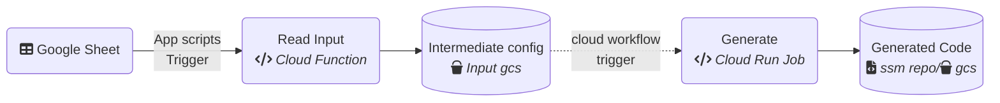
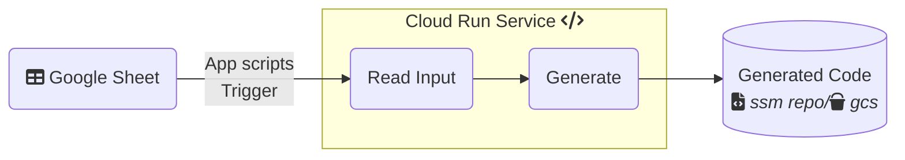

## EzyTF

Effortlessly generate Google Cloud Terraform configurations using Google Sheets as input.<br>
Modular, Customizable and Scalable TF Generation by design.

### Google Sheet
Make a copy of this [Google Sheet](https://docs.google.com/spreadsheets/d/1cvjTM4QiovZVsnrQYRvSAxD6dmru5UZ8384sycsFsRE/copy), follow details in instruction tab

### Architecture Diagram
ezytf can be deployed in either service or workflow mode.


#### Workflow

#### Service



### Environment Variables

| Variable           | Description                                                                    | Required |
| ------------------ | ------------------------------------------------------------------------------ | -------- |
| EZTF_SHEET_ID      | google sheet ID                                                                | yes      |
| EZTF_CONFIG_DIR    | local dir of intermediate config, default:ezytf-gen-data/eztf-config           | no       |
| EZTF_OUTPUT_DIR    | local output dir to store output, default:ezytf-gen-data/eztf-output           | no       |
| EZTF_INPUT_CONFIG  | local intermediate config file or gcs stored config file                       | no       |
| EZTF_CONFIG_BUCKET | gcs bucket name to store intermediate config                                   | no       |
| EZTF_OUTPUT_BUCKET | gcs bucket name to store output                                                | no       |
| EZTF_SSM_HOST      | ssm host `https://[INSTANCE_ID]-[PROJECT_NUMBER].[LOCATION].sourcemanager.dev` | no       |
| EZTF_MODE          | value:`workflow`/`service` see above diagram for reference                     | no       |

### Install Dependencies
```
cd read_input && npm install
cd ../
cd generate && pipenv install
```

### Run Locally
```
export EZTF_SHEET_ID=[EZTF_SHEET_ID]
./generator.sh
```

### Run locally https mode

```
npm start --prefix read_input
curl localhost:8080  -d '{"spreadsheetId":"$EZTF_SHEET_ID", "generateCode":true}' -H "Content-Type: application/json" 
```

### Build Locally
```
docker build -t ezytf:latest . -f Dockerfile
```


### Run Container Locally (as service)
```
PORT=8080 && \
TOKEN=access_token_file && \
gcloud auth print-access-token > $TOKEN &&
ADC=~/.config/gcloud/application_default_credentials.json && \
docker run -p 9090:${PORT} \
-e EZTF_MODE=service \
-e EZTF_SHEET_ID=[EZTF_SHEET_ID] \
-e EZTF_SSM_HOST=[EZTF_SSM_HOST] \
-e GOOGLE_APPLICATION_CREDENTIALS=/tmp/google_adc.json \
-e GOOGLE_CLOUD_PROJECT=[PROJECT_ID] \
-e EZTF_ACCESS_TOKEN_FILE=/tmp/access_token_file \
-v $(pwd)/$TOKEN:/tmp/access_token_file:ro \
-v $ADC:/tmp/google_adc.json:ro \
-v $(pwd)/ezytf-gen-data:/app/ezytf-gen-data \
ezytf:latest
```

### Push Container
```
export ARTIFACT_REGISTRY_PATH=us-docker.pkg.dev/[PROJECT_ID]/[REPO_NAME]/ezytf
docker tag ezytf:latest $ARTIFACT_REGISTRY_PATH/ezytf:latest . -f Dockerfile && \
docker push $ARTIFACT_REGISTRY_PATH/ezytf:latest
```

### Deploy Cloud Run Service (Service mode)
```
gcloud run deploy ezytf --region [REGION] --image=$ARTIFACT_REGISTRY_PATH/ezytf:latest \
--memory 2Gi \
--cpu 1000m \
--min-instances 0 \
--max-instances 2 \
--service-account [EZTF_SERVICE_ACCOUNT] \
--execution-environment gen2 \
--set-env-vars CI=1 \
--set-env-vars EZTF_MODE=service \
--set-env-vars EZTF_SSM_HOST=[EZTF_SSM_HOST]
--no-cpu-throttling
```

### Deploy read_input Cloud Function (Workflow Mode)
```
cd read_input && \
gcloud functions deploy ezytf-read-input \
--gen2 \
--runtime=nodejs20 \
--region [REGION] \
--source=. \
--entry-point=generateTF \
--trigger-http \
--run-service-account=[EZTF_SERVICE_ACCOUNT] \
--set-env-vars EZTF_CONFIG_BUCKET=[EZTF_CONFIG_BUCKET]
```

### Deploy generate Cloud Run Job (Workflow Mode)
```
gcloud run jobs deploy ezytf-generate --region [REGION] --image=$ARTIFACT_REGISTRY_PATH/ezytf:latest \
--memory 2Gi \
--cpu 1000m \
--service-account [EZTF_SERVICE_ACCOUNT] \
--command="sh generator.sh" \
--set-env-vars CI=1 \
--set-env-vars EZTF_MODE=workflow \
--set-env-vars EZTF_SSM_HOST=[EZTF_SSM_HOST] 
```